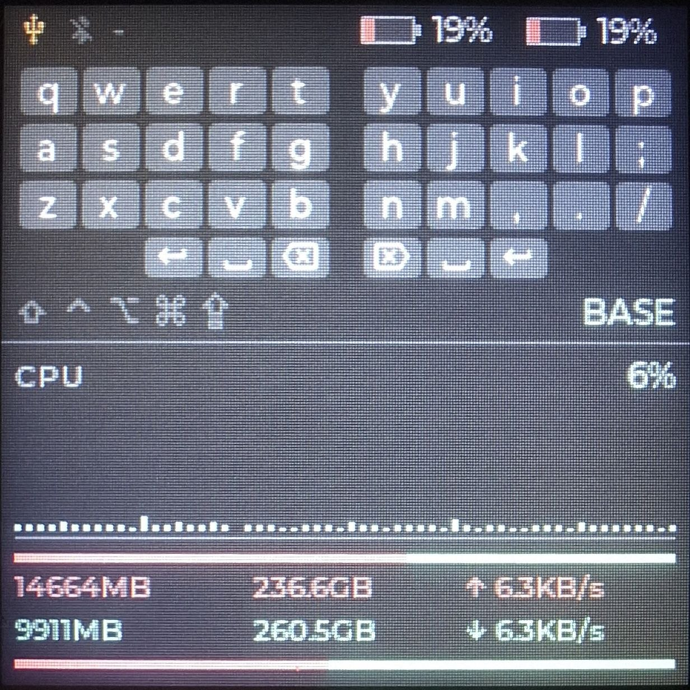

**English** · [Русский](README.ru.md)

# zmk-dongle-tft

A ZMK module that turns a split-keyboard dongle into two things at once: a
keymap display and a host system monitor, on one 240×240 SPI panel.

The dongle already knows which layer is active, which modifiers are held and
how full each half's battery is. It is also plugged into the computer, so it
can be told anything the computer knows. This module puts the first on the top
half of the screen and the second on the bottom.

| Design | On the dongle |
| :----: | :-----------: |
|  |  |

Reading it from the top:

| Row | What it shows |
| --- | ------------- |
| status | USB and Bluetooth state — carried by the icon **colour**, not by extra text — the BLE profile number, and both halves' battery levels |
| keymap | the active layer. Legends are what each key would type *right now*, so they follow shift and caps lock |
| modifiers | the modifiers currently held, plus caps lock in amber, and the layer name |
| CPU | the current percentage over 58 samples of history |
| memory / disk / network | used on the red row, free on the green one, between two usage bars in the same two colours |

The keyboard half is event-driven and entirely self-contained: it keeps working
with nothing running on the host. The monitor half needs a small daemon on the
computer (included, macOS); without it those rows read `--`.

## Hardware

### Bill of materials

The hardware is the [Snake Dongle](https://github.com/joaopedropio/snake-dongle)
— board, screen and enclosure. Use **its** bill of materials, which is kept up
to date with working part links; the parts that matter here are:

| Qty | Part | Notes |
| --- | ---- | ----- |
| 1 | Pro Micro nRF52840 | a nice!nano v2 works. Other boards need their own pin overlay |
| 1 | 1.54" TFT 240×240 ST7789 module | the display from the Snake Dongle BOM. The [Waveshare 1.54" LCD](https://www.waveshare.com/1.54inch-LCD-Module.htm) is an alternative, with its own case variant |
| — | thin wire | 1.27 mm flat ribbon per that BOM; a larger gauge is easier to solder but harder to fit |
| 1 | printed enclosure | see [Case](#case) |

The panel must be **240×240 and ST7789V**: the layout is placed to the pixel and
other sizes will not fit.

You do **not** need the Snake Dongle's buzzer or its push buttons — this
firmware drives neither. Everything else in its BOM applies.

### Wiring

Signals and pins are exactly what [`dongle_tft.overlay`](boards/shields/dongle_tft/dongle_tft.overlay)
declares — if you re-pin anything, change both.

| Signal | Display pin | nRF52840 | Pro Micro pad |
| ------ | ----------- | -------- | ------------- |
| Power | `VCC` | — | `3V3` |
| Ground | `GND` | — | `GND` |
| SPI clock | `SCL` / `CLK` / `SCK` | P0.17 | `D2` |
| SPI data | `SDA` / `DIN` / `MOSI` | P0.20 | `D3` |
| Chip select | `CS` | P0.11 | `D7` |
| Data / command | `DC` | P0.24 | `D5` |
| Reset | `RES` / `RST` | P0.22 | `D4` |
| Backlight | `BLK` / `BL` | P1.04 | `D8` |

Notes on that table:

- The pin choice follows the [Snake Dongle](https://github.com/joaopedropio/snake-dongle),
  which is why its enclosures fit. Backlight on `D8` is what makes it dimmable
  rather than hard-wired to `VCC`.
- **`D2`/`D3` are also the Pro Micro I2C pads.** The module disables `i2c0`
  because on nRF52840 that peripheral shares its instance with `SPIM0` *and*
  sits on those exact pins. You therefore cannot combine `dongle_tft` with a
  shield that wants the I2C bus, such as an SSD1306 OLED.
- The display is driven **write-only** — there is no MISO wire.
- Module pin counts vary between sellers, and so does whether `CS` is broken out
  at all. Wire the display the way the
  [Snake Dongle wiring diagrams](https://github.com/joaopedropio/snake-dongle#wiring-diagram-)
  show it (use the "WITH Backlight Control" one — this firmware dims the
  backlight); the table above is the same pin-out in text form.

### Case

Print one of the enclosures from **[felixJR123/Snake-Dongle-Case](https://github.com/felixJR123/Snake-Dongle-Case)**
— follow that repository's build guide for orientation, screws and heat-set
inserts. Pick the variant that matches your screen:

| Screen | Folder in that repo |
| ------ | ------------------- |
| Waveshare 1.54" | `Files/Waveshare Screen` |
| Original Snake Dongle screen, tactile switch | `Files/Tactile Switches` |
| Original Snake Dongle screen, mouse switches | `Files/Mouse Switches` |

There is also a `Files/Monitor Mount` stand, which is a good fit here: a system
monitor you never look at is not much use.

That guide is written for the Snake Dongle firmware, which uses a buzzer and an
action button. **This module uses neither** — skip those parts of the BOM and
their wiring. Everything else (body, screen holder, back cover, screws) applies
unchanged.

## Firmware

### Add the module to your zmk-config

In your config repository's `config/west.yml`, add this repo as a project:

```yaml
manifest:
  remotes:
    - name: zmkfirmware
      url-base: https://github.com/zmkfirmware
    - name: you
      url-base: https://github.com/<you>
  projects:
    - name: zmk
      remote: zmkfirmware
      revision: main
      import: app/west.yml
    - name: zmk-dongle-tft
      remote: you
      revision: main
  self:
    path: config
```

Then add `dongle_tft` next to your keyboard's own dongle shield in
`build.yaml`:

```yaml
include:
  - board: nice_nano//zmk
    shield: my_keyboard_dongle dongle_tft
    artifact-name: my_keyboard_dongle_tft
```

Push, and download the artifact from the Actions run. That is the whole
firmware side — the shield brings its own Kconfig defaults (colour depth,
LVGL buffers, a custom status screen, the second USB serial function).

Requirements on the shield you pair it with: it has to be a **split central**
(`CONFIG_ZMK_SPLIT_ROLE_CENTRAL=y`) with two peripherals if you want both
battery gauges. [`boards/shields/example_dongle/`](boards/shields/example_dongle/)
is a minimal one you can copy.

### Flash

Double-tap reset on the board — a `NICENANO` drive appears — and copy
`zmk.uf2` onto it. The drive disappears on its own; a "disk not ejected
properly" warning at that point is normal.

## Host daemon

The bottom half is fed over a USB serial port that this firmware exposes
alongside the HID interfaces. [`host/sysmon-daemon/`](host/sysmon-daemon/) is a
Python daemon for macOS that samples CPU, memory, disk and network twice a
second and writes one line per sample. See
[its README](host/sysmon-daemon/README.md) for installation, the launchd agent
and the line protocol.

The protocol is deliberately trivial (one `|`-separated line of text, a `PING`
→ `SYSMON1` handshake so the daemon can find the right port), so a daemon for
another OS is a short script. Nothing else has to change on the firmware side.

## Adapting it to your keymap

**ZMK keeps no printable label for a binding at runtime** — a behaviour is a
device pointer plus two integers. So the legends cannot be derived from your
keymap; they live in a table you edit:
[`keymap_legend.c`](boards/shields/dongle_tft/keymap_legend.c).

Rules for that table:

- One row of 36 entries per layer, in binding order: three rows of 5+5, then
  the 3+3 thumbs. Layers in the same order as your keymap node.
- `NULL` for `&none` — the key is drawn as an empty slot.
- Spell `&trans` out with the legend it falls through to.
- Hold-taps get their tap side: `&hml LSHIFT A` is `"a"`.
- A single ASCII character is taken to be *what the key types unmodified*, so
  write it unshifted — `"a"`, `"1"`, `","`. Shift and caps lock are applied at
  draw time, so those keys change on screen as you hold them. Keys that already
  send a shifted keycode (`&kp EXCL`) are written as the character they produce
  and are left alone.
- Anything longer is drawn as-is in a small font; two or three characters fit a
  key.
- For an icon, use the `MDI_*` macros from
  [`mdi_icons.h`](boards/shields/dongle_tft/mdi_icons.h).

The layer *name* comes from ZMK's `display-name`, so that needs nothing.

What is **not** adjustable without editing `dongle_ui.c`: the grid is 3×(5+5)
plus 3+3 thumbs. A different key count needs new geometry constants.

## Icons

Every icon is a [Material Design Icon](https://pictogrammers.com/library/mdi/).
LVGL cannot read an SVG icon set at runtime, so the ~30 glyphs used are baked
into a font subset by [`tools/gen_mdi_font.py`](tools/gen_mdi_font.py):

```sh
python3 tools/gen_mdi_font.py     # needs network and node (for lv_font_conv)
```

`mdi_font_10.c`, `mdi_font_12.c` and `mdi_icons.h` are its **output** — to add
an icon, put its MDI name in that script's `ICONS` list and re-run it, rather
than editing the generated files.

## Building locally

Optional — CI is enough for normal use. The one trap: this repository is a
Zephyr *module*, and a module's Kconfig is looked up at `<module>/zephyr/Kconfig`.
If you also make it a west topdir, `west update` clones Zephyr into that same
`zephyr/` and configuration dies with `recursive 'source' of 'Kconfig.zephyr'`.
Keep the workspace outside the checkout:

```sh
export DONGLE_TFT=/path/to/zmk-dongle-tft

mkdir -p ~/dongle-tft-west/config
ln -s "$DONGLE_TFT/config/west.yml" ~/dongle-tft-west/config/west.yml
git -C ~/dongle-tft-west/config init -q . && git -C ~/dongle-tft-west/config add -A
git -C ~/dongle-tft-west/config commit -qm "west manifest"

cd ~/dongle-tft-west
west init -l config && west update && west zephyr-export
python3.13 -m venv .venv          # Zephyr 4.1 wants Python 3.10-3.13
.venv/bin/pip install -r zephyr/scripts/requirements-base.txt

source .venv/bin/activate
west build -p -d build/example -s zmk/app -b nice_nano//zmk -- \
  -DZMK_CONFIG="$DONGLE_TFT/config" -DZMK_EXTRA_MODULES="$DONGLE_TFT" \
  -DSHIELD="example_dongle dongle_tft"
```

`-DZMK_EXTRA_MODULES` takes a `;`-separated list, so to build against your own
keyboard module too:

```sh
-DZMK_EXTRA_MODULES="/path/to/your-keyboard;$DONGLE_TFT"
```

You will also need the Zephyr SDK 0.17.x with `arm-zephyr-eabi`.

## How it is put together

| File | Role |
| ---- | ---- |
| `dongle_tft.overlay` | display, backlight and the second CDC-ACM function |
| `custom_status_screen.c` | ZMK entry point; also swaps in an RGB565 byte-swapping flush callback, which the ST7789V needs |
| `zmk_status.c` | ZMK event listeners → UI setters |
| `dongle_ui.c` | all of the drawing and the pixel geometry |
| `keymap_legend.c` | the per-layer legend table |
| `sysmon_uart.c`, `sysmon_state.c` | the serial line protocol; no ZMK dependency, so they also work in a plain Zephyr app |

Two details worth knowing if you go editing:

- Battery levels are read from ZMK's own array via
  `zmk_split_central_get_peripheral_battery_level()` rather than from the event
  payload. `ZMK_DISPLAY_WIDGET_LISTENER` keeps a single state slot and
  `k_work_submit()` on a pending item is a no-op, so with two halves reporting
  at once one gauge would silently never be painted — and a peripheral pushes
  its level only when it *changes*, so it would stay blank for hours.
- `CONFIG_ZMK_DISPLAY_BLANK_ON_IDLE` is forced off. A monitor that blanks after
  the idle timeout is not a monitor.

## Credits

- [ZMK](https://github.com/zmkfirmware/zmk).
- [joaopedropio/snake-dongle](https://github.com/joaopedropio/snake-dongle) —
  the hardware this pin-out and its display devicetree come from.
- [felixJR123/Snake-Dongle-Case](https://github.com/felixJR123/Snake-Dongle-Case) —
  the enclosure.
- [englmaxi/zmk-dongle-display](https://github.com/englmaxi/zmk-dongle-display) —
  the module and widget-listener patterns this follows.
- [Material Design Icons](https://pictogrammers.com/library/mdi/), Apache-2.0.

## Licence

MIT, see [LICENSE](LICENSE). The bundled MDI glyph subset is Apache-2.0 from
the Pictogrammers project.
