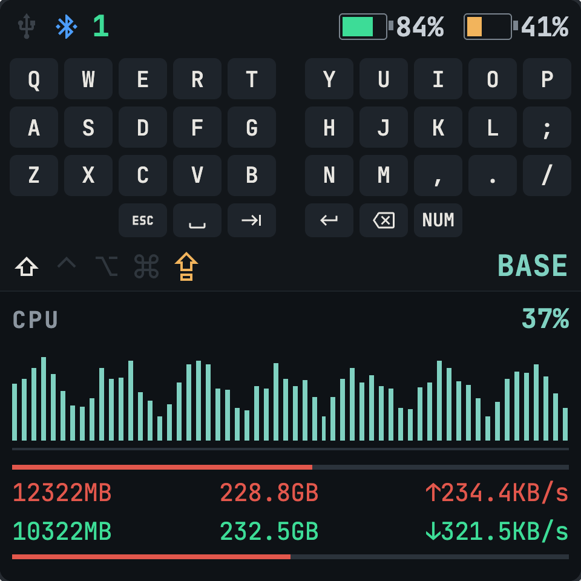
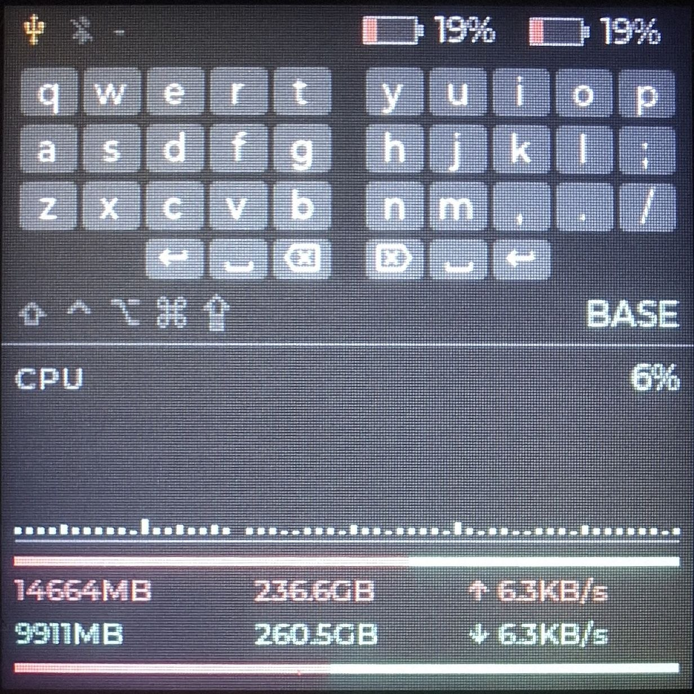
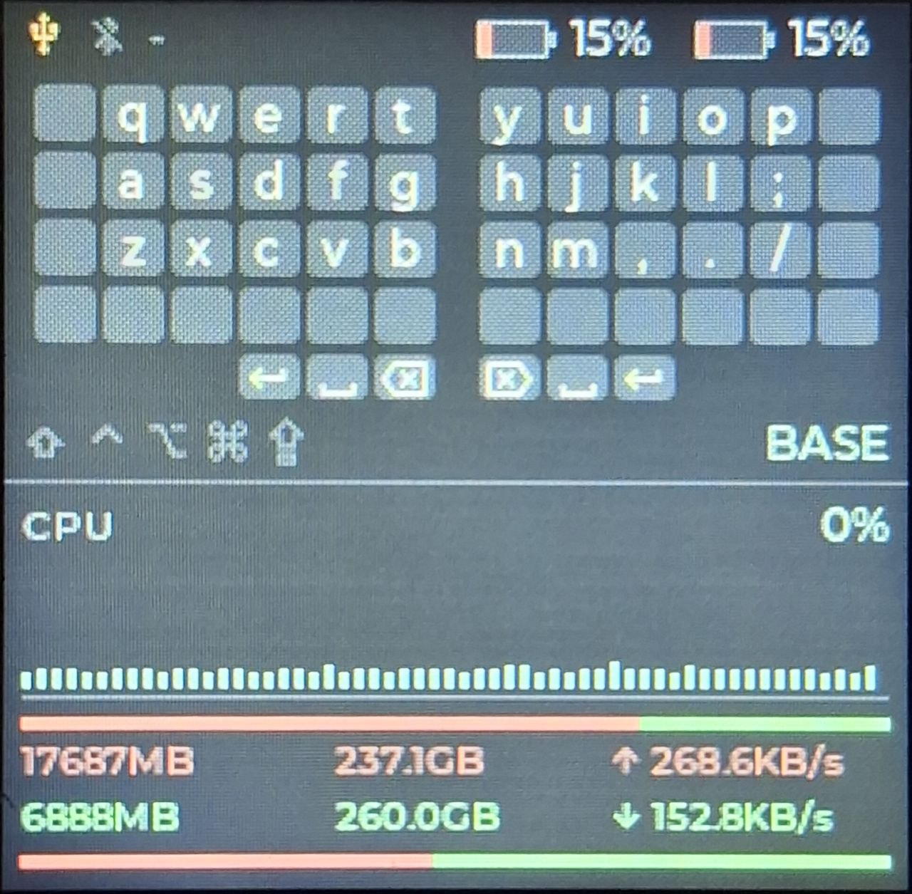

[English](README.md) · **Русский**

# zmk-dongle-keymap-sysmon

Модуль ZMK, который превращает донгл сплит-клавиатуры сразу в две вещи: дисплей
раскладки и системный монитор хоста — на одной SPI-панели 240×240.

Донгл и так знает, какой слой активен, какие модификаторы удерживаются и
насколько заряжены половины. При этом он воткнут в компьютер, а значит ему можно
сообщить всё, что знает компьютер. Первое этот модуль выводит на верхнюю
половину экрана, второе — на нижнюю.

| Макет | На донгле | Пример сетки 6×4 |
| :---: | :-------: | :--------------: |
|  |  |  |

Сверху вниз:

| Строка | Что показывает |
| ------ | -------------- |
| статус | состояние USB и Bluetooth — передаётся **цветом** иконки, без лишнего текста — номер BLE-профиля и заряд обеих половин |
| кеймап | активный слой. Подписи — то, что клавиша напечатает *прямо сейчас*, поэтому они следуют за Shift и Caps Lock |
| модификаторы | удерживаемые модификаторы, Caps Lock отдельным цветом, и имя слоя |
| CPU | текущий процент и 58 отсчётов истории |
| память / диск / сеть | занято в красной строке, свободно в зелёной, между двумя полосами тех же двух цветов |

Клавиатурная половина событийная и полностью автономная: она работает, даже если
на хосте ничего не запущено. Нижней половине нужен небольшой демон на компьютере
(входит в комплект, macOS); без него в её строках стоит `--`.

## Железо

### Список деталей

Железо — это [Snake Dongle](https://github.com/joaopedropio/snake-dongle): плата,
экран и корпус. Пользуйтесь **его** списком деталей, там актуальные ссылки на
магазины; здесь важны вот эти позиции:

| Кол-во | Деталь | Примечания |
| ------ | ------ | ---------- |
| 1 | Pro Micro nRF52840 | подходит nice!nano v2. Для других плат нужен свой overlay с пинами |
| 1 | модуль TFT 1.54" 240×240 ST7789 | экран из BOM Snake Dongle. Альтернатива — [Waveshare 1.54" LCD](https://www.waveshare.com/1.54inch-LCD-Module.htm), под него есть свой вариант корпуса |
| — | тонкий провод | по тому же BOM — плоский шлейф 1.27 мм; провод потолще паять легче, но уложить труднее |
| 1 | напечатанный корпус | см. [Корпус](#корпус) |

Панель обязательно **240×240 и ST7789V**: раскладка выверена по пикселям, другие
размеры не встанут.

Баззер и кнопки из Snake Dongle **не нужны** — эта прошивка их не использует.
Всё остальное из его BOM в силе.

### Схема соединения

Сигналы и пины ровно те, что объявлены в
[`dongle_tft.overlay`](boards/shields/dongle_tft/dongle_tft.overlay) — если
меняете распиновку, правьте и то и другое.

| Сигнал | Пин дисплея | nRF52840 | Площадка Pro Micro |
| ------ | ----------- | -------- | ------------------ |
| Питание | `VCC` | — | `3V3` |
| Земля | `GND` | — | `GND` |
| SPI clock | `SCL` / `CLK` / `SCK` | P0.17 | `D2` |
| SPI data | `SDA` / `DIN` / `MOSI` | P0.20 | `D3` |
| Chip select | `CS` | P0.11 | `D7` |
| Data / command | `DC` | P0.24 | `D5` |
| Reset | `RES` / `RST` | P0.22 | `D4` |
| Подсветка | `BLK` / `BL` | P1.04 | `D8` |
| Кнопка тем | — | P0.31 | `D21`/`A3` |

Что стоит знать про эту таблицу:

- Распиновка повторяет [Snake Dongle](https://github.com/joaopedropio/snake-dongle),
  поэтому корпуса под него подходят.
- **Яркость подсветки не регулируется.** ZMK включает `zmk,display-led` на полную
  при старте, а `led_off()` вызывает только когда гасит дисплей — что этот шилд
  отключает. То есть сейчас `D8` ведёт себя ровно как `VCC`, и посадить `BL`
  прямо на `VCC` тоже сработает. Пин оставлен на PWM-канале и объявлен как
  `pwm-leds` только чтобы регулировка осталась возможной:
  `led_set_brightness()` работал бы, но его никто не вызывает.
- **`D2`/`D3` — это ещё и площадки I2C у Pro Micro.** Модуль отключает `i2c0`,
  потому что на nRF52840 эта периферия делит инстанс с `SPIM0` *и* сидит ровно на
  этих пинах. Поэтому `dongle_tft` нельзя совмещать с шилдом, которому нужна шина
  I2C, — например с OLED на SSD1306.
- Дисплей работает **только на запись** — провода MISO нет.
- Число пинов у модулей разных продавцов отличается, как и наличие выведенного
  `CS`. Подключайте экран так, как показано на
  [схемах Snake Dongle](https://github.com/joaopedropio/snake-dongle#wiring-diagram-);
  таблица выше — та же распиновка текстом. Подходит любая из двух его схем:
  «WITH Backlight Control» соответствует этой таблице, вторая сажает `BL` на
  `VCC` — что, как сказано выше, здесь ничего не меняет.

### Темы

Короткое нажатие на action-кнопку Snake Dongle переключает четыре палитры:

| Тема | |
| ---- | --- |
| `dark` | палитра, в которой экран рисовался |
| `light` | те же оттенки, затемнённые, на почти белом фоне |
| `amber` | янтарь на чёрном; занято и свободно остаются красным и лаймовым, чтобы монитор не потерял полярность |
| `night` | `dark` примерно вполовину яркости. Подсветка не регулируется, так что это способ не освещать панелью тёмную комнату |

Выбор сохраняется во flash и переживает перезагрузку и перепрошивку. Правка
палитры или добавление новой — это одна таблица в
[`dongle_theme.c`](boards/shields/dongle_tft/dongle_theme.c).

Кнопка не обязательна: удалите узел `dongle_tft_theme_button` в своём overlay —
колбэк исчезнет, останется последняя сохранённая тема.

### Корпус

Напечатайте один из корпусов из
**[felixJR123/Snake-Dongle-Case](https://github.com/felixJR123/Snake-Dongle-Case)**
— ориентация печати, винты и латунные вставки описаны в его гайде. Вариант
выбирается по экрану:

| Экран | Папка в том репозитории |
| ----- | ----------------------- |
| Waveshare 1.54" | `Files/Waveshare Screen` |
| Оригинальный экран Snake Dongle, тактовая кнопка | `Files/Tactile Switches` |
| Оригинальный экран Snake Dongle, мышиные свитчи | `Files/Mouse Switches` |

Там же есть подставка `Files/Monitor Mount` — здесь она к месту: системный
монитор, на который вы не смотрите, не очень полезен.

Тот гайд написан под прошивку Snake Dongle, где есть баззер и кнопка действия.
**Этот модуль не использует ни то, ни другое** — эти пункты BOM и их проводку
можно пропустить. Всё остальное (корпус, держатель экрана, задняя крышка, винты)
применимо без изменений.

## Прошивка

### Подключить модуль к своему zmk-config

В `config/west.yml` своего конфиг-репозитория добавьте этот репозиторий как
проект:

```yaml
manifest:
  remotes:
    - name: zmkfirmware
      url-base: https://github.com/zmkfirmware
    - name: you
      url-base: https://github.com/<you>
  projects:
    - name: zmk
      remote: zmkfirmware
      revision: main
      import: app/west.yml
    - name: zmk-dongle-keymap-sysmon
      remote: you
      revision: master
  self:
    path: config
```

Затем в `build.yaml` допишите `dongle_tft` рядом с шилдом донгла своей
клавиатуры:

```yaml
include:
  - board: nice_nano//zmk
    shield: my_keyboard_dongle dongle_tft
    artifact-name: my_keyboard_dongle_tft
```

Пуш — и скачивайте артефакт из прогона Actions. Это вся работа со стороны
прошивки: шилд приносит свои дефолты Kconfig (глубина цвета, буферы LVGL,
кастомный status screen, второй USB-serial).

Требование к шилду, с которым вы его собираете: он должен быть **split central**
(`CONFIG_ZMK_SPLIT_ROLE_CENTRAL=y`), и с двумя перифериями, если нужны оба
индикатора заряда. [`boards/shields/example_dongle/`](boards/shields/example_dongle/)
— минимальный такой шилд, его можно скопировать.

### Прошить

Дважды быстро нажмите reset на плате — появится диск `NICENANO` — и скопируйте на
него `zmk.uf2`. Диск исчезнет сам; предупреждение «диск извлечён неправильно» в
этот момент нормально.

## Демон на хосте

Нижнюю половину кормит USB-serial порт, который эта прошивка выставляет рядом с
HID-интерфейсами. [`host/sysmon-daemon/`](host/sysmon-daemon/) — демон на Python
для macOS: дважды в секунду снимает CPU, память, диск и сеть и пишет по строке на
выборку. Установка, launchd-агент и протокол — в
[его README](host/sysmon-daemon/README.ru.md).

Протокол намеренно примитивный (одна строка текста с разделителем `|`, handshake
`PING` → `SYSMON1`, чтобы демон нашёл нужный порт), так что демон для другой ОС —
это короткий скрипт. Со стороны прошивки менять при этом нечего.

## Как приспособить под свой кеймап

**ZMK не хранит печатных подписей для биндингов в рантайме** — поведение это
указатель на устройство плюс два целых числа. Поэтому подписи нельзя вывести из
вашего кеймапа; они лежат в таблице, которую вы правите:
[`keymap_legend.c`](boards/shields/dongle_tft/keymap_legend.c).

Правила этой таблицы:

- По 36 записей на слой, в порядке биндингов: три ряда 5+5, затем 3+3 больших
  пальца. Слои — в том же порядке, что в вашем узле keymap.
- `NULL` для `&none` — клавиша рисуется пустым слотом.
- `&trans` выписывайте той подписью, в которую он проваливается.
- У hold-tap берётся тап-сторона: `&hml LSHIFT A` — это `"a"`.
- Одиночный ASCII-символ считается тем, *что клавиша печатает без модификаторов*,
  поэтому пишите его без Shift — `"a"`, `"1"`, `","`. Shift и Caps Lock
  применяются при отрисовке, так что такие клавиши меняются на экране, пока вы их
  удерживаете. Клавиши, которые сами посылают шифтованный кейкод (`&kp EXCL`),
  пишутся тем символом, который дают, и не преобразуются.
- Всё, что длиннее, рисуется как есть мелким шрифтом; в клавишу влезает два-три
  символа.
- Для иконки используйте макросы `MDI_*` из
  [`mdi_icons.h`](boards/shields/dongle_tft/mdi_icons.h).

*Имя* слоя берётся из `display-name` в ZMK, так что с ним ничего делать не надо.

### Форма сетки

Три значения Kconfig описывают ваш сплит, и экран раскладывается из них сам —
размер клавиши, положение пальцевых блоков, где проходит разделитель и сколько
высоты остаётся графику CPU:

```
CONFIG_DONGLE_TFT_COLUMNS=6   # на руку, 4-6
CONFIG_DONGLE_TFT_ROWS=4      # 3 или 4
CONFIG_DONGLE_TFT_THUMBS=5    # на руку, 1-5
```

Колонок 4–6 на руку, рядов 3 или 4, больших пальцев 1–5 на руку, причём пальцев
не больше, чем колонок. Экран остаётся 240×240 при любом выборе, поэтому более
крупная сетка покупается более узкими клавишами и более низким графиком:

| Сплит | Клавиш | Клавиша | Палец | График CPU | |
| ----- | -----: | ------- | ----- | ---------: | --- |
| 4×3+3 | 30 | 25×17 | 25×14 | 44 px | |
| **5×3+3** | **36** | **20×17** | **20×14** | **44 px** | по умолчанию; в ежедневной работе |
| 5×3+5 | 40 | 20×17 | 20×14 | 44 px | |
| 6×3+3 | 42 | 16×17 | 16×14 | 44 px | |
| 6×3+5 | 46 | 16×17 | 16×14 | 44 px | |
| 5×4+3 | 46 | 20×15 | 20×12 | 34 px | |
| 6×4+3 | 54 | 16×15 | 16×12 | 34 px | проверено на железе: мелко, но читаемо |
| 6×4+5 | 58 | 16×15 | 16×12 | 34 px | |

Четвёртый ряд стоит 10 px истории графика — именно оттуда берётся высота, потому
что всё ниже графика прибито к нижнему краю. Шрифт подписи подбирается по высоте
клавиши, так что в четырёхрядной сетке он уменьшается сам.

Реальный пробег есть только у `5×3+3`; `6×4+3` прошивали один раз и читалось
нормально. Остальные получаются из той же арифметики, но глазами их не смотрели.

Пул объектов LVGL растёт вместе с сеткой — по одному label на клавишу, а его
исчерпание даёт молчаливое зависание, а не ошибку, — так что ничего больше
подкручивать не нужно.

Две вещи проверяются на этапе компиляции, поэтому неверное число даёт ошибку
сборки, а не поехавший экран:

- `LEGEND_TABLE_*` в самой таблице легенд должно совпадать с конфигурацией —
  иначе клавиши, которые вы забыли дописать, просто остались бы пустыми;
- а конфигурация должна совпадать с выбранным **`zmk,physical-layout`**, где и
  лежит настоящее число клавиш.

Что **не** выводится — это сама компоновка: две руки плюс по одному пальцевому
блоку, прижатому к центру. Что-то принципиально другое — колонка нумпада, пятый
ряд, лестничные пальцы — требует работы с геометрией в `dongle_ui.c`. Вычитать
её из физического layout'а тоже нельзя: на Charybdis все три левых пальцевых
клавиши стоят в одной точке и различаются только поворотом.

## Иконки

Все иконки — [Material Design Icons](https://pictogrammers.com/library/mdi/).
LVGL не умеет читать набор SVG в рантайме, поэтому ~30 используемых глифов
запекаются в подмножество шрифта скриптом
[`tools/gen_mdi_font.py`](tools/gen_mdi_font.py):

```sh
python3 tools/gen_mdi_font.py     # нужны сеть и node (для lv_font_conv)
```

`mdi_font_10.c`, `mdi_font_12.c` и `mdi_icons.h` — это его **вывод**. Чтобы
добавить иконку, впишите её имя MDI в список `ICONS` в скрипте и перезапустите
его, а не правьте сгенерированные файлы.

## Локальная сборка

Не обязательна — для обычного использования достаточно CI. Единственная ловушка:
этот репозиторий — Zephyr-*модуль*, а Kconfig модуля ищется по пути
`<модуль>/zephyr/Kconfig`. Если сделать его ещё и west topdir, то `west update`
склонирует Zephyr в тот же самый `zephyr/`, и конфигурация упадёт с
`recursive 'source' of 'Kconfig.zephyr'`. Держите воркспейс вне рабочей копии:

```sh
export KEYMAP_SYSMON=/path/to/zmk-dongle-keymap-sysmon

mkdir -p ~/keymap-sysmon-west/config
ln -s "$KEYMAP_SYSMON/config/west.yml" ~/keymap-sysmon-west/config/west.yml
git -C ~/keymap-sysmon-west/config init -q . && git -C ~/keymap-sysmon-west/config add -A
git -C ~/keymap-sysmon-west/config commit -qm "west manifest"

cd ~/keymap-sysmon-west
west init -l config && west update && west zephyr-export
python3.13 -m venv .venv          # Zephyr 4.1 хочет Python 3.10-3.13
.venv/bin/pip install -r zephyr/scripts/requirements-base.txt

source .venv/bin/activate
west build -p -d build/example -s zmk/app -b nice_nano//zmk -- \
  -DZMK_CONFIG="$KEYMAP_SYSMON/config" -DZMK_EXTRA_MODULES="$KEYMAP_SYSMON" \
  -DSHIELD="example_dongle dongle_tft"
```

`-DZMK_EXTRA_MODULES` принимает список через `;`, так что собрать вместе со
своим модулем клавиатуры можно так:

```sh
-DZMK_EXTRA_MODULES="/path/to/your-keyboard;$KEYMAP_SYSMON"
```

Ещё понадобится Zephyr SDK 0.17.x с `arm-zephyr-eabi`.

## Как это устроено

| Файл | Назначение |
| ---- | ---------- |
| `dongle_tft.overlay` | дисплей, подсветка и второй CDC-ACM |
| `custom_status_screen.c` | точка входа ZMK; здесь же подменяется flush-колбэк с байтсвопом RGB565, который нужен ST7789V |
| `zmk_status.c` | слушатели событий ZMK → сеттеры UI |
| `dongle_ui.c` | вся отрисовка и пиксельная геометрия |
| `keymap_legend.c` | таблица подписей по слоям |
| `sysmon_uart.c`, `sysmon_state.c` | построчный протокол; без зависимости от ZMK, поэтому работают и в обычном Zephyr-приложении |

Две детали, которые полезно знать, если полезете править:

- Уровни заряда читаются из собственного массива ZMK через
  `zmk_split_central_get_peripheral_battery_level()`, а не из полезной нагрузки
  события. У `ZMK_DISPLAY_WIDGET_LISTENER` одна ячейка состояния, а
  `k_work_submit()` для уже поставленной в очередь работы — no-op, так что при
  одновременном отчёте двух половин один индикатор молча никогда бы не
  отрисовался. И он бы таким и остался на часы: периферия присылает уровень
  только когда он *меняется*.
- `CONFIG_ZMK_DISPLAY_BLANK_ON_IDLE` принудительно выключен. Монитор, который
  гаснет по таймауту простоя, — не монитор.

## Благодарности

- [ZMK](https://github.com/zmkfirmware/zmk).
- [joaopedropio/snake-dongle](https://github.com/joaopedropio/snake-dongle) —
  железо, откуда взяты распиновка и devicetree дисплея.
- [felixJR123/Snake-Dongle-Case](https://github.com/felixJR123/Snake-Dongle-Case) —
  корпус.
- [englmaxi/zmk-dongle-display](https://github.com/englmaxi/zmk-dongle-display) —
  паттерны модуля и widget-listener, которым здесь следуют.
- [Material Design Icons](https://pictogrammers.com/library/mdi/), Apache-2.0.

## Лицензия

MIT, см. [LICENSE](LICENSE). Вложенное подмножество глифов MDI — Apache-2.0 от
проекта Pictogrammers.
